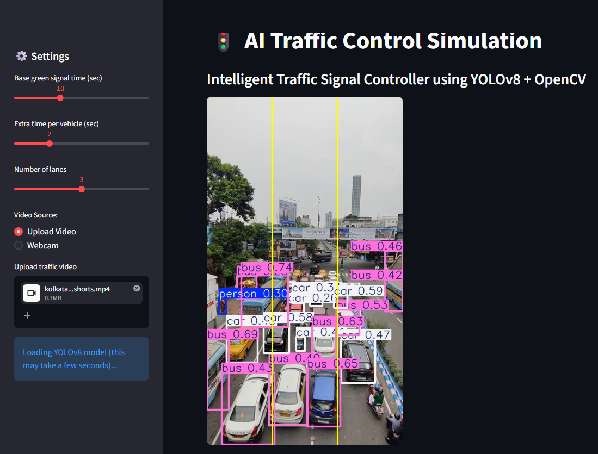
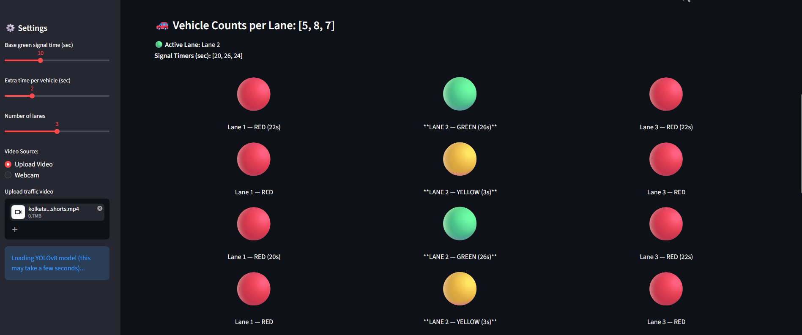

#  AI Traffic Control Simulation

An intelligent traffic signal control system that dynamically adjusts signal timings based on real-time vehicle density using YOLOv8 and OpenCV.

---

## Overview
This project simulates a smart traffic management system that detects vehicles from live video or uploaded footage and allocates green signal time to the most congested lane.

---

##  Features
- Real-time vehicle detection using YOLOv8
- Lane-wise vehicle counting
- Dynamic signal timing
- Smart traffic light switching (Green, Yellow, Red)
- Supports webcam and uploaded video
- Interactive UI using Streamlit

---

##  Tech Stack
- Python
- Streamlit
- OpenCV
- YOLOv8 (Ultralytics)
- NumPy

---

## 📁 Project Structure
ai-traffic-control-simulation/
│
├── app.py
├── requirements.txt
├── runtime.txt
└── README.md

##  How to Run

pip install -r requirements.txt  
streamlit run app.py  

## 🌐 Live Demo
👉 (https://ai-traffic-control-simulation-zlndhyezptjawhnkq7s96x.streamlit.app/)

## 📸 Preview

| Live Detection | Traffic Analysis |
|----------------|-----------------|
|  |  |

---

## 👩‍💻 Author
Vaishnavi Ramesh
